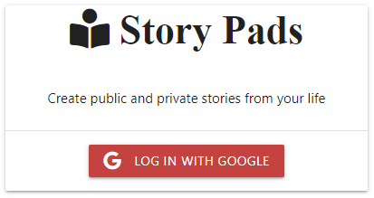

# :memo:Story Pads
App to share the public and private story using Express, MongoDB &amp; Google OAuth 2.0
<p align="center"></a></p>
<p align="center">
  <a href="https://story-pad-google-oauth20.herokuapp.com/"></a>
  <a href="https://github.com/soaibsafi/story-pads/blob/dev/LICENSE"></a>
</p>

# :hammer: Build Setup

:heavy_plus_sign: Install dependencies
```
$ npm install # Or yarn install
```
:wrench: Create config/config.env 
```
PORT = 3000
MONGO_URI = 
GOOGLE_CLIENT_ID = 
GOOGLE_CLIENT_SECRET = 
```
:rocket: Run at localhost:3000
```
$ npm run dev
```
